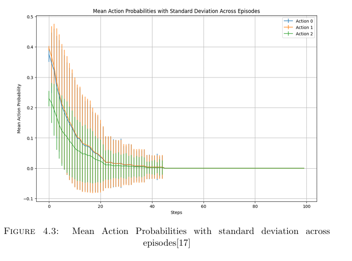

# Smart Power Allocation for Variable Loads  
## Uninterrupted Supply Using Actor-Critic Method

This repository contains all the source code, data, and results for the research project:  
**"Smart Power Allocation for Variable Loads: Uninterrupted Supply Using Actor-Critic Method"**

## 🧠 Project Overview

The goal of this project is to improve voltage regulation and power flow optimization in **DC/DC converters** under **variable load conditions** using an **Actor-Critic reinforcement learning algorithm**. This approach is compared against traditional **PID control** to validate its efficiency and robustness in smart power systems.

The project demonstrates:
- Efficient **real-time power allocation**
- **Dynamic voltage regulation**
- High **average evaluation reward**
- Statistically significant improvement over baseline control methods

---

---

## 📊 Key Results

### Table 4.1 – Average Evaluation Reward by Control Method

| Control Method | Average Evaluation Reward |
|----------------|---------------------------|
| Actor-Critic   | 50.191                    |
| PID Control    | 5.005                     |

> The Actor-Critic method outperformed PID control by a significant margin, achieving a **10x higher reward**, validating its effectiveness in regulating voltage and managing power flow efficiently.
### 📈 Result Visualization

### Table 4.2 – Statistical Significance

| Statistic       | Value   |
|-----------------|---------|
| t-statistic     | 164.303 |
| p-value         | 1.294   |
| Conclusion      | Significant Performance Difference |

---

## ✅ Key Takeaways

- The **Actor-Critic reinforcement learning method** significantly improves power allocation for variable loads.
- Demonstrated **faster convergence**, **better reward maximization**, and **more stable voltage regulation** compared to traditional methods.
- Results were validated with **quantitative metrics and statistical analysis**, confirming the model's real-world applicability.

---

## 📌 Keywords

`Reinforcement Learning` • `Actor-Critic` • `DC/DC Converters` • `Voltage Regulation` • `Power Flow Optimization` • `PID Control` • `Smart Grid` • `Policy Gradient` • `Energy Systems` • `Machine Learning`

---

## 📧 Contact

For any queries or collaboration interests, feel free to reach out:  
**Bhavarth Bhangdia**  
[https://www.linkedin.com/in/bhavarth7bhangdia/]

---

